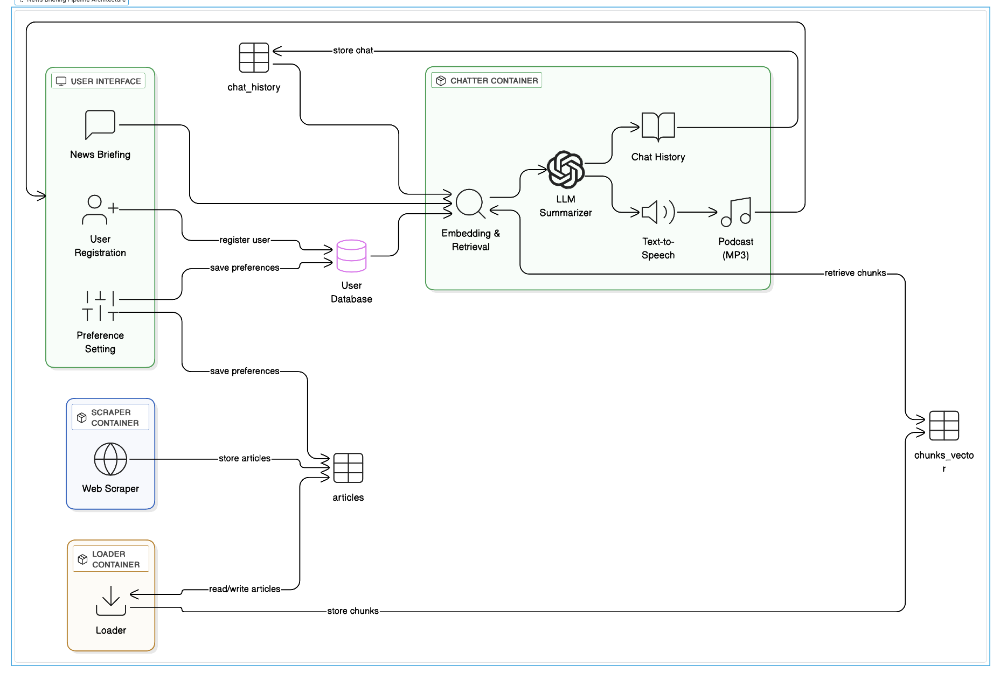

# 📆 NewsJuice (AC215 - Milestone 2)

> Personalized daily podcast summaries of Harvard-related news — built with a scalable RAG pipeline.

---

## 👥 Team

- **Khaled Aly**  
- **Zac Sardi-Santos**  
- **Joshua Rosenblum**  
- **Christian Michel**

**Team name:** `NewsJuice`

---

## 📚 Project Overview

**NewsJuice** is an application that generates a **customized podcasts** summarizing the latest news based on the user’s interests.  
It is primarily designed for the **Harvard community**, pulling content from Harvard-related news sources.

Users can:
- Set preferences and topics of interest  
- Provide a short news brief  
- Receive an **audio podcast** generated automatically  
- *(Future)* Interactively **ask follow-up questions** during playback  

---

## 🎯 Milestone 2 — Prototype Scope

In Milestone 2, we built a complete **RAG (Retrieval-Augmented Generation)** pipeline with the following features:

1. **Scraping:** Collect Harvard-related news (RSS/Atom feeds, websites, etc.)  
2. **Ingestion:** Load scraped data into a **PostgreSQL database** (hosted on GCP). Specifically, we load the scraped articles into our articles table. 
3. **Processing:**  
   - Semantic chunking (using Vertex AI). The chunks are stored in our chunks_vector table.
   - Text embedding (using `sentence-transformers/all-mpnet-base-v2`). The text embeddings are used for embedding the chunks, AND also for embedding the user query for retrieval.
4. **Vector Storage:** Store embeddings in a **pgvector**-enabled PostgreSQL database table, titled chunks_vector. 
5. **Input Query & User_ID** Collect the unique user identification and the specific user query for podcast generation. 
6. **Retrieval**  
   - Retrieve the most relevant news chunks from our database based on embedded user query
7. **LLM Podcast Generation**
    - Generate a text summary of the relevant news chunks with an LLM API call (Google Gemini). 
    - Convert the text summary to audio (mp3) via TTS API call (Google Cloud Text-To-Speech API)
8. **Chat Log History**
    - Model text output and user identification pair saved to PostgreSQL database table, titled llm-conversations

---

## ⚙️ Pipeline Architecture



The pipeline consists of **three standalone containers** plus **volume-mounted Python modules**, with a **PostgreSQL vector database** (on **Google Cloud SQL**) serving as the central data store.

### App Screen Design

To see the app screen, please see the file "NewsJuice screen flow.pdf" 

### 🧱 Standalone Containers

1. **🕸️ Scraper**  
   - Fetches news articles from multiple Harvard-related sources on the web 
   - Stores them in the `articles` table of the PostgreSQL database `newsdb`
   - **Runs standalone**: `make -f MakefileChatter scrape`

2. **📥 Loader**  
   - Loads unprocessed articles (`vflag = 0`) from the `articles` table of `newsdb`
   - Performs **chunking** and **embedding** using Vertex AI and sentence-transformers
   - Stores the chunks in the `chunks_vector` table of `newsdb`
   - **Runs standalone**: `make -f MakefileChatter load`

3. **💬 Chatter** (Orchestration Hub)
   - Accepts a user's **query** and **user_id** via interactive interface
   - **Integrates retriever and TTS as volume-mounted Python modules**
   - Orchestrates the complete RAG pipeline: Query → Retrieve → Generate → Convert to Audio
   - Saves conversation history in the `llm_conversations` table
   - **Runs standalone**: `make -f MakefileChatter chat`

### 🔧 Volume-Mounted Services

4. **🔍 Retriever** (Python Module)
    - **Volume-mounted** into chatter container at `/app/retriever`
    - Embeds user queries using `sentence-transformers/all-mpnet-base-v2`
    - Performs cosine similarity search on `chunks_vector` table
    - Returns top 2 most relevant chunks with similarity scores
    - **Not run standalone** - called by chatter service

5. **🗣️ TTS** (Python Module)
    - **Volume-mounted** into chatter container at `/app/tts`
    - Converts podcast text to audio using Google Cloud Text-to-Speech
    - Uses `en-US-Neural2-J` voice for high-quality output
    - Saves MP3 files to `audio_output/` directory
    - **Not run standalone** - called by chatter service

---

## 🚀 Usage

This project supports both **one-line execution** and **step-by-step** runs using `Makefile` commands.

### ▶️ Quick Start (Recommended)

**Complete Pipeline (Data Ingestion + Podcast Generation):**
```bash
# Step 1: Scrape and load data
make run -f MakefileBatch  # Scrape and load Harvard news articles

# Step 2: Generate podcasts interactively
make run -f MakefileChatter    # Start interactive podcast generation
```

**Individual Services:**
```bash
# Data ingestion only
make run -f MakefileBatch scrape  # Scrape articles to database
make run -f MakefileBatch load   # Process articles into vector chunks

# Podcast generation only (requires pre-loaded data)
make run -f MakefileChatter   # Interactive podcast generation
```

### 🔄 Complete Workflow

#### Phase 1: Data Ingestion
1. **Scrape Articles**: `make run -f MakefileBatch scrape`
   - Fetches Harvard Gazette and Crimson articles
   - Stores in `articles` table with duplicate detection
   
2. **Process & Embed**: `make run -f MakefileBatch load`
   - Chunks articles using semantic chunking (Vertex AI)
   - Embeds chunks using `sentence-transformers/all-mpnet-base-v2`
   - Stores in `chunks_vector` table with pgvector

#### Phase 2: Podcast Generation
3. **Interactive Mode**: `make run -f MakefileChatter chat`
   - Prompts for user ID and question
   - Retrieves top 2 relevant chunks via vector similarity
   - Generates podcast script using Gemini API
   - Converts to audio using Google Cloud TTS
   - Saves conversation to `llm_conversations` table

### 🛠️ Service Management

**Start Database Proxy:**
```bash
make run -f MakefileChatter up-proxy
```

**Stop All Services:**
```bash
make run -f MakefileChatter down
```

**Build Images:**
```bash
make run -f MakefileChatter build
```

---

## 🗄️ Database Schema

### `articles` Table
Stores raw scraped articles from Harvard sources:
- `id` - Primary key
- `author` - Article author
- `title` - Article title
- `summary` - Article summary
- `content` - Full article content
- `source_link` - Original article URL
- `source_type` - Source identifier (gazette, crimson)
- `fetched_at` - Timestamp when scraped
- `published_at` - Original publication date
- `vflag` - Processing flag (0=unprocessed, 1=processed)
- `article_id` - Unique article identifier

### `chunks_vector` Table
Stores processed article chunks with vector embeddings:
- `id` - Primary key
- `author` - Article author
- `title` - Article title
- `summary` - Article summary
- `content` - Full article content
- `source_link` - Original article URL
- `source_type` - Source identifier
- `fetched_at` - Timestamp when scraped
- `published_at` - Original publication date
- `chunk` - Text chunk content
- `chunk_index` - Chunk position within article
- `embedding` - Vector embedding (pgvector)
- `article_id` - Reference to original article

### `llm_conversations` Table
Stores user interactions and AI responses:
- `id` - Primary key
- `user_id` - User identifier
- `model_name` - AI model used (gemini-2.5-flash)
- `conversation_data` - JSON containing question, response, and metadata
- `created_at` - Timestamp of conversation
- `updated_at` - Last update timestamp

---

## 🔑 Prerequisites

1. **Install Cloud SQL Proxy** (to connect locally to the GCS-hosted database):

```bash
brew install cloud-sql-proxy
```
Or via Google Cloud SDK:
```bash
brew install google-cloud-sdk
```

2. **Service Account Key**  
   Place your GCP service account key file here:
```
../secrets/gcp.json
```
Service account:  
`newsjuice-proxy@newsjuice-123456.iam.gserviceaccount.com`

The SQL proxy runs automatically via `docker-compose`, opening a local port (`5432`) that connects securely to the Cloud SQL instance.

---

## 🔧 Troubleshooting

### Common Issues

1. **Database Connection Failed**
   - Ensure the Cloud SQL proxy is running: `make run -f MakefileChatter up-proxy`
   - Verify DATABASE_URL is correctly set in environment
   - Check network connectivity to Google Cloud

2. **Gemini API Not Working**
   - Verify service account credentials are properly mounted
   - Check Vertex AI API is enabled in Google Cloud Console
   - Ensure service account has `roles/aiplatform.user` role

3. **TTS Service Not Working**
   - Verify Cloud Text-to-Speech API is enabled
   - Check service account has `roles/cloudtts.serviceAgent` role
   - Ensure audio output directory is writable

4. **Vector Search Not Working**
   - Verify `chunks_vector` table exists and has data
   - Check if loader service has been run: `make run -f MakefileChatter load`
   - Ensure pgvector extension is installed in PostgreSQL

5. **Audio Playback Issues**
   - Install `mpv` locally: `brew install mpv` (macOS) or `apt install mpv` (Linux)
   - Check audio files are saved in `audio_output/` directory
   - Verify audio file permissions

6. **No Articles Found**
   - Run scraper first: `make run -f MakefileChatter scrape`
   - Check if articles were successfully stored in `articles` table
   - Verify scraper service account has proper permissions

### Service Logs

The services provide detailed logging for:
- Database connection status and vector search results
- Gemini API call results and response generation
- TTS service calls and audio file generation
- Retriever service calls and similarity scores
- Error messages and stack traces
- User interaction flow and conversation logging

---

## 📊 Data

**News Sources:** (WIP)

- ✅ The Harvard Gazette
    https://news.harvard.edu/gazette/feed/
- ✅ The Harvard Crimson
    https://www.thecrimson.com/
- Harvard Magazine
    https://www.harvardmagazine.com/harvard-headlines
- Colloquy: The alumni newsletter for the Graduate School of Arts and Sciences.
    https://gsas.harvard.edu/news/all
- Harvard Business School Communications Office: Publishes news and research from the business school.
    https://www.hbs.edu/news/Pages/browse.aspx
- Harvard Law Today: The news hub for Harvard Law School.
    https://hls.harvard.edu/today/
- Harvard Medical School Office of Communications and External Relations - News: Disseminates news from the medical school.
    https://hms.harvard.edu/news

---

---

## 🗄️ Database Details

- **Account:** `harvardnewsjuice@gmail.com`  
- **Project:** `NewsJuice`  
- **Project ID:** `newsjuice-123456`  
- **Instance:** `newsdb-instance`  
- **Region:** `us-central1`  
- **Database:** `newsdb` (PostgreSQL 15)  
- **Tables:** `articles`, `chunks_vector`  

> ⚠️ **Note:** The above identifiers are for documentation and environment setup.

---

## 📊 Database Schema

### 📰 Table: `articles`
Stores raw scraped news articles.

```sql
id BIGSERIAL PRIMARY KEY,
author TEXT,
title TEXT,
summary TEXT,
content TEXT,
source_link TEXT, 
source_type TEXT,
fetched_at TIMESTAMPTZ,
published_at TIMESTAMPTZ,
vflag INT,
article_id TEXT
```

### 🧠 Table: `chunks_vector`
Stores semantic chunks and vector embeddings.

```sql
id BIGSERIAL PRIMARY KEY,
author TEXT,
title TEXT,
summary TEXT,
content TEXT,
source_link TEXT, 
source_type TEXT,
fetched_at TIMESTAMPTZ,
published_at TIMESTAMPTZ,
chunk TEXT,
chunk_index INT,
embedding VECTOR(768),
article_id TEXT
```

### 🧠 Table: `llm_conversations`
Stores the history of conversations

```sql
id BIGSERIAL PRIMARY KEY,
user_id TEXT,
model_name TEXT,
conversation_data JSON,
created_at TIMESTAMPTZ,
updated_at TIMESTAMPTZ
```

---

## In future milestones, we plan to:
- Summarize the `conversation_data` that we store in the `llm_conversations` table as context for future user queries to get a sense of the user's preferences and provide the history of past conversations for better podcast generation.
- Transition to interacting with the model with only speech rather than typing in the command line.
- Build the interactive component of our model so that the user can interupt the podcast and ask followup questions.

## References

For this project we have used ChatGPT, Gemini and tools like Figma, app.eraser.io for learning purposes.

## 📜 License

This project is part of the **NewsJuice** prototype.  
All rights reserved.

