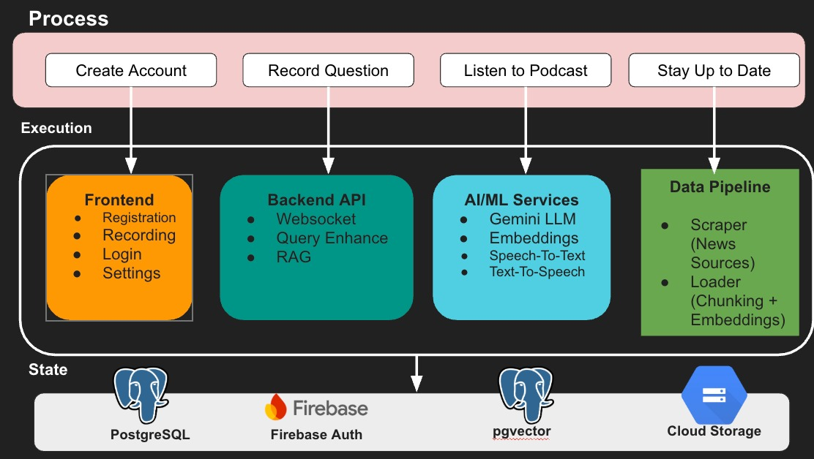

# NewsJuice Application Design Document

**Version**: 1.0
**Date**: November 25, 2024
**Project**: AC215 NewsJuice - AI-Powered Podcast Generation Platform

---

## Table of Contents

1. [Executive Summary](#1-executive-summary)
2. [Solution Architecture](#2-solution-architecture)
3. [Technical Architecture](#3-technical-architecture)
4. [User Interface Design](#4-user-interface-design)
5. [Code Organization](#5-code-organization)
6. [Data Flow Diagrams](#6-data-flow-diagrams)
7. [Conclusion](#7-conclusion)

---

## 1. Executive Summary

NewsJuice is an AI-powered platform that transforms Harvard news articles into personalized, voice-interactive podcast summaries. Users record voice questions about Harvard news, and the system generates and streams custom podcast responses in real-time using Retrieval-Augmented Generation (RAG) and Google's Gemini AI.

**Core Value Proposition**: Frees up time for busy people by delivering concise, AI-generated podcasts that answer specific questions about Harvard news, eliminating the need to read and manually search for multiple articles.

---

## 2. Solution Architecture

### 2.1 High-Level System Overview 




### 2.2 Component Interactions

#### Frontend (React)
- **Purpose**: User interface for voice recording and podcast playback
- **Key Features**:
  - User registration and login (Firebase)
  - Audio recording via Web Audio API
  - Real-time status updates during processing
  - Audio playback of generated podcasts
  - Settings and preference management

**Data Flow**:
```
User → Frontend → WebSocket (ws://backend/ws/chat) → Backend API → Audio Stream → Frontend
```

#### Backend API (FastAPI + WebSocket)
- **Purpose**: Orchestrates the RAG pipeline and manages real-time communication
- **Key Components**:
  - **WebSocket Handler**: Receives audio, sends status updates and audio streams
  - **Query Enhancement**: Expands user queries into sub-queries using Gemini
  - **RAG Retrieval**: Searches vector database for relevant news chunks
  - **Podcast Generation**: Generates podcast scripts using Gemini LLM

**Processing Flow**:
```
Audio Input → Speech-to-Text (Google STT API) → Query Enhancement →
RAG Retrieval → Podcast Generation (Gemini LLM API) → Text-to-Speech (Google TTS API) → Stream Output to Frontend (via Websocket)
```

#### Data Pipeline (ETL)
- **Scraper**:
  - Scrapes 10+ Harvard news sources (Gazette, Crimson, HBS, HLS, etc.)
  - Calls Vertex AI to generate article tags
  - Stores in `articles` table with `vflag=0`

- **Loader**:
  - Fetches unprocessed articles (`vflag=0`)
  - Chunks text semantically (350 chars, 20 char overlap)
  - Generates embeddings via Vertex AI text-embedding-004
  - Stores in `chunks_vector` table with pgvector
  - Updates `vflag=1` to mark as processed

### 2.3 State Management

#### PostgreSQL + pgvector (Cloud SQL)
- **articles**: Raw scraped news articles
- **chunks_vector**: Semantic chunks with 768-dim embeddings
- **users**: User profiles (Firebase UID, email)
- **user_preferences**: Key-value settings per user
- **audio_history**: Log of questions and generated podcasts

#### Firebase Authentication
- User login/registration with email/password
- JWT token generation and verification
- Session management

---

## 3. Technical Architecture

### 3.1 Overview (UPLOAD DIAGRAM HERE)


### 3.2 Frameworks and Libraries

#### Backend Dependencies
```python
# Core Framework
fastapi>=0.104.0
uvicorn[standard]>=0.24.0

# AI/ML
google-cloud-aiplatform>=1.38.0
google-cloud-speech>=2.21.0
google-genai>=0.1.0

# Database
psycopg[binary,pool]>=3.1.0
pgvector>=0.2.0

# Authentication
firebase-admin>=6.2.0

# Text Processing
langchain>=0.1.0
langchain-experimental>=0.0.47
```

#### Frontend Dependencies
```json
{
  "react": "^18.2.0",
  "react-router-dom": "^6.20.0",
  "firebase": "^12.5.0",
  "framer-motion": "^10.16.16",
  "lucide-react": "^0.294.0"
}
```

### 3.3 Design Patterns

#### 1. Microservices Architecture
- **Separation of Concerns**: Scraper, Loader, and Backend API are independent services
- **Benefits**: Independent deployment, scalability, fault isolation

#### 2. Repository Pattern
- **Database Abstraction**: `user_db.py` provides clean interface for database operations
- **Benefits**: Easier testing, database migration flexibility

```python
# Example: user_db.py
def create_user(user_id: str, email: str) -> dict:
    """Create user - abstracts SQL details"""
    ...

def get_user_preferences(user_id: str) -> dict:
    """Get preferences - single source of truth"""
    ...
```

#### 3. Strategy Pattern
- **Query Enhancement**: Dynamically generates multiple sub-queries
- **Retrieval Strategy**: Uses different retrieval methods based on query type

#### 4. Pipeline Pattern
- **RAG Pipeline**: Sequential processing with clear stages
```
Audio → Transcription → Enhancement → Retrieval →
Generation → TTS → Streaming
```

#### 5. Observer Pattern
- **WebSocket Status Updates**: Frontend observes backend state changes
- **Real-time Notifications**: Status messages sent at each pipeline stage

```python
# Backend sends status updates
await websocket.send_json({"status": "transcribing"})
await websocket.send_json({"status": "retrieving"})
await websocket.send_json({"status": "generating"})
```

#### 6. Dependency Injection
- **Environment Configuration**: `.env.local` injects configuration
- **Service Accounts**: Mounted as volumes in Docker

### 3.4 API Design

#### WebSocket API (`/ws/chat`)
- **Protocol**: WebSocket (ws:// for local, wss:// for production)
- **Authentication**: Firebase JWT token in query parameter
- **Message Format**:

**Client → Server (Audio)**:
```
Binary: PCM audio bytes (Int16Array)
```

**Client → Server (Control)**:
```json
{"type": "complete"}  // End recording
{"type": "reset"}     // Clear buffer
```

**Server → Client (Status)**:
```json
{"status": "transcribing"}
{"status": "transcribed", "text": "user question..."}
{"status": "enhancing_query"}
{"status": "retrieving"}
{"status": "generating"}
{"status": "podcast_generated", "text": "podcast script..."}
{"status": "streaming_audio"}
{"status": "complete"}
{"error": "error message"}
```

**Server → Client (Audio)**:
```
Binary: WAV audio chunks (8192 bytes)
```

#### REST API Endpoints

```
GET  /healthz
POST /api/user/create          (requires auth)
GET  /api/user/preferences     (requires auth)
POST /api/user/preferences     (requires auth)
GET  /api/user/history         (requires auth)
```

### 3.5 Security Architecture

#### Authentication Flow
```
1. User logs in → Firebase generates JWT token
2. Frontend stores token in localStorage
3. Frontend sends token with every request (WebSocket query param or HTTP header)
4. Backend verifies token with Firebase Admin SDK
5. Backend extracts user_id from token
6. Backend authorizes request based on user_id
```

#### Security Measures
- ✅ **CORS**: Restricted to known origins (`http://localhost:3000`, `https://www.newsjuiceapp.com`)
- ✅ **Token Expiration**: Firebase tokens expire after 1 hour
- ✅ **Service Account Keys**: Mounted as read-only volumes, never committed to git
- ✅ **Environment Variables**: Secrets in `.env.local` (gitignored)
- ✅ **SQL Injection Prevention**: Parameterized queries with psycopg3
- ✅ **Input Validation**: FastAPI Pydantic models

---

## 4. User Interface Design

### 4.1 Page Structure

#### Login Page (`/login`)
- Email/password input fields
- Firebase authentication
- Redirect to podcast page on success

#### Registration Page (`/register`)
- Email/password registration
- Creates Firebase account
- Auto-login after registration

#### Podcast Page (`/podcast`) - Main Interface
- **Animated Orb**: Visual feedback (10 different styles)
- **Record Button**: Press-and-hold to record
- **Status Display**: Real-time processing updates
- **Audio Playback**: Auto-plays generated podcast
- **Menu**: Access to Settings, About, Logout

#### Settings Page (`/settings`)
- User preferences management
- Account information (planned)
- Password management (planned)

#### About Page (`/about`)
- Team information
- Project description

### 4.2 User Interaction Flow

```
1. User opens app (localhost:3000 or newsjuiceapp.com)
2. Login/Register with Firebase
3. Navigate to Podcast page
4. Press and hold record button
5. Speak question (e.g., "What's happening with Harvard admissions?")
6. Release button
7. Watch status updates:
   - "Transcribing audio..."
   - "Enhancing query..."
   - "Retrieving articles..."
   - "Generating podcast..."
   - "Streaming audio..."
8. Listen to generated podcast (auto-plays)
9. View history or ask another question
```

### 4.3 Responsive Design
- Mobile-first design
- Responsive grid layout
- Touch-optimized buttons
- Adaptive font sizes

---

## 5. Code Organization

### 5.1 Project Structure

```
ac215_NewsJuice/
│
├── services/
│   ├── chatter_deployed/          # Backend API
│   │   ├── main.py                # FastAPI entry point
│   │   ├── speech_to_text_client.py
│   │   ├── query_enhancement.py
│   │   ├── retriever.py
│   │   ├── live_api_tts_client.py
│   │   ├── helpers.py
│   │   ├── user_db.py
│   │   ├── firebase_auth.py
│   │   ├── Dockerfile
│   │   ├── docker-compose.local.yml
│   │   ├── .env.local             # Local config (gitignored)
│   │   ├── env.yaml               # Cloud Run config
│   │   ├── cloudbuild.yaml        # CI/CD
│   │   ├── README.md
│   │   └── DEPLOYMENT.md
│   │
│   ├── scraper/                   # ETL - News scraping
│   │   ├── scrapers.py
│   │   ├── article_tags_builder.py
│   │   ├── db_manager.py
│   │   └── Dockerfile
│   │
│   ├── loader_deployed/           # ETL - Embeddings
│   │   ├── loader.py
│   │   ├── Dockerfile
│   │   └── docker-compose.local.yml
│   │
│   └── k-frontend/                # React frontend
│       └── podcast-app/
│           ├── src/
│           │   ├── pages/
│           │   │   ├── Podcast.jsx
│           │   │   ├── Login.jsx
│           │   │   ├── Registration.jsx
│           │   │   ├── Settings.jsx
│           │   │   └── AboutUs.jsx
│           │   ├── components/
│           │   ├── firebase/
│           │   │   └── config.js
│           │   └── main.jsx
│           ├── package.json
│           ├── vite.config.js
│           └── Dockerfile
│
├── secrets/                       # Service account keys (gitignored)
│   ├── sa-key.json
│   ├── gemini-service-account.json
│   └── firebase-service-account.json
│
└── README.md
```

### 5.2 Module Responsibilities

#### Backend Modules

| Module | Responsibility | Key Functions |
|--------|----------------|---------------|
| `main.py` | FastAPI app, WebSocket handler, routing | `websocket_chat()`, health check |
| `speech_to_text_client.py` | Audio transcription | `audio_to_text()` |
| `query_enhancement.py` | Query expansion with Gemini | `enhance_query_with_gemini()` |
| `retriever.py` | Vector search in pgvector | `search_articles()`, `VertexEmbeddings` |
| `live_api_tts_client.py` | Text-to-speech streaming | `text_to_audio_stream()` |
| `helpers.py` | Gemini API calls | `call_gemini_api()` |
| `user_db.py` | Database operations | `create_user()`, `save_audio_history()` |
| `firebase_auth.py` | Token verification | `verify_token()` |

#### Frontend Components

| Component | Responsibility |
|-----------|----------------|
| `Podcast.jsx` | Main interface, audio recording, WebSocket |
| `Login.jsx` | User authentication |
| `Registration.jsx` | New user signup |
| `Settings.jsx` | User preferences |
| `AboutUs.jsx` | Project information |

---


### 5.3 CI/CD Pipeline

```
Developer Push → GitHub → Cloud Build →
Artifact Registry → Cloud Run Deployment
```

**Build Steps**:
1. Build Docker image from Dockerfile
2. Push to Artifact Registry
3. Deploy to Cloud Run with env.yaml
4. Connect to Cloud SQL via Unix socket
5. Expose HTTPS endpoint

---

## 6. Data Flow Diagrams

### 6.1 User Request Flow

```
[User Records Audio]
         ↓
[Frontend: Web Audio API]
         ↓
[WebSocket: Send PCM bytes]
         ↓
[Backend: Receive audio buffer]
         ↓
[Speech-to-Text API] → Text transcript
         ↓
[Query Enhancement] → 3 sub-queries
         ↓
[For each sub-query:]
├─ text-embedding-004 → 768-dim vector
├─ pgvector cosine similarity search
└─ Return top 2 chunks
         ↓
[Deduplicate chunks by ID]
         ↓
[Gemini LLM] → Podcast script (150-200 words)
         ↓
[Gemini Live API] → PCM audio stream
         ↓
[Convert PCM → WAV]
         ↓
[WebSocket: Stream 8KB chunks]
         ↓
[Frontend: Audio playback]
         ↓
[Save to audio_history table]
```

### 6.2 ETL Data Flow

```
[News Websites (10+ sources)]
         ↓
[Scraper: BeautifulSoup/Selenium]
         ↓
[Gemini: Generate tags]
         ↓
[Store in articles table (vflag=0)]
         ↓
[Loader: Fetch vflag=0 articles]
         ↓
[SemanticChunker: 350 chars, 20 overlap]
         ↓
[text-embedding-004: Generate 768-dim vectors]
         ↓
[Store in chunks_vector table]
         ↓
[Update vflag=1 in articles]
```

---


## 7. Conclusion

NewsJuice demonstrates a modern, AI-powered application architecture leveraging:
- **Microservices** for modularity
- **Real-time communication** via WebSocket
- **Advanced RAG** with query enhancement
- **Serverless deployment** for scalability
- **Vector search** with pgvector for semantic retrieval

The system successfully transforms complex news articles into accessible, personalized podcast summaries, freeing up users' time while keeping them informed about Harvard news.

---

**Document Version**: 1.0
**Last Updated**: November 25, 2024
**Authors**: AC215 NewsJuice Team
