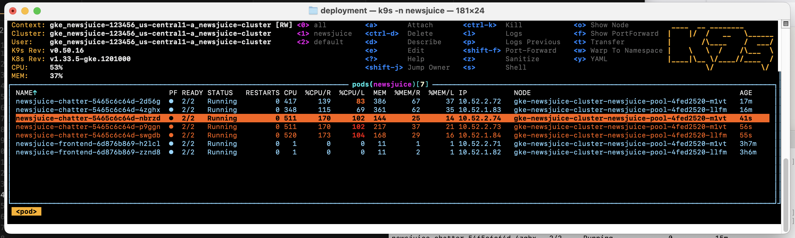

# Scaling used for the NewsJuice app


1. Manual horizontal scaling: 2 pods implemented (base configuration)  

2. We added a Horizontal Pod Autoscaler (HPA) in pulumi - scales pods based on CPU usage.  
Parameter:  
* min_replicas=2  
* max_replicas=10  
* average_utilization=50 (CPU)

3. Cluster Autoscaler — scales nodes (already enabled in GKE by default).

Here is the implenmented HPA:
```bash
root@32cc13d7288e:/app# kubectl get hpa -n newsjuice
NAME                    REFERENCE                      TARGETS       MINPODS   MAXPODS   REPLICAS   AGE
newsjuice-chatter-hpa   Deployment/newsjuice-chatter   cpu: 1%/50%   2         10        2          45s
```

## Run a load test to see how pods are spun off:

Need install hey and k9s on your local machine  


### Instalation of k9s: on your local PC:
```bash
brew install k9s
gcloud container clusters get-credentials newsjuice-cluster --zone=us-central1-a --project=newsjuice-123456
gcloud components install gke-gcloud-auth-plugin
```
### Instalation of hey: on your local PC:
```bash
brew install hey
```

Then you can see the monitor screen with
```bash
k9s -n newsjuice
```

### Running a load test to see new pods spinning up


Run various terminals in parallel to see the different outputs. But Terminal 3 + 4 is enough for demo.  

* Terminal 1 — Watch HPA:  
```bash
kubectl get hpa -n newsjuice -w
```

* Terminal 2 — Watch pods:  
```bash
kubectl get pods -n newsjuice -w
```

* Terminal 3  - Watch everything 
```bash
k9s -n newsjuice
```

* Terminal 4 (on local machine ) — Generate heavy load:  
```bash
hey -z 120s -c 100 https://www.newsjuiceapp.com/api/health
```
Meaning    
-z 120 = 120 seconds load  
-c 100 = 100 concurrent users  
This is just calling the health check endpoint of the chatter api  
NOTE: this endpoints needed to be excluded from middleware (done in main.py of chatter)   


## Example output from above test set-up with k9s:



